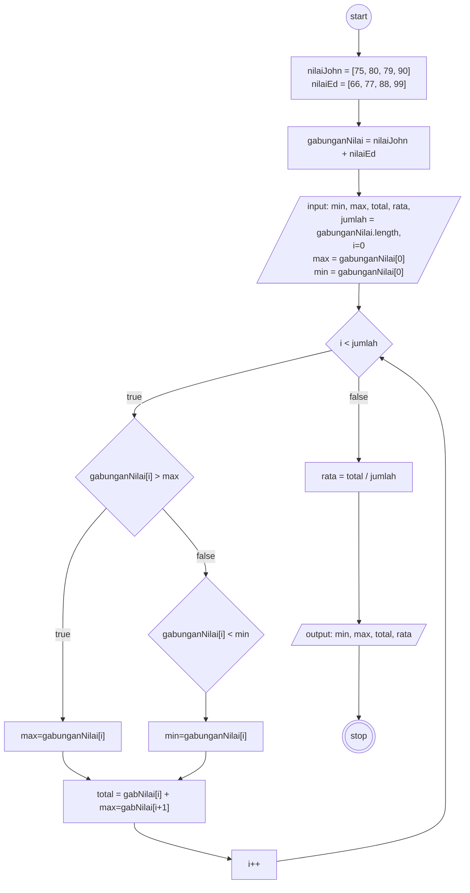

```mermaid
flowchart TD
start@{shape: circ}
array@{label: "nilaiJohn = [75, 80, 79, 90]
nilaiEd = [66, 77, 88, 99]"}
gabung@{label: "gabunganNilai = nilaiJohn + nilaiEd"}
init@{shape: lean-r, label: "input: min, max, total, rata,
jumlah = gabunganNilai.length,
i=0
max = gabunganNilai[0]
min = gabunganNilai[0]"}

fori@{shape: diamond, label: "i < jumlah"}
i++
ifmax@{shape: diamond, label: "gabunganNilai[i] > max"}
truemax@{label: "max=gabunganNilai[i]"}

ifmin@{shape: diamond, label: "gabunganNilai[i] < min"}
truemin@{label: "min=gabunganNilai[i]"}

total@{label: "total = gabNilai[i] + max=gabNilai[i+1]"}

output@{shape: lean-r, label: "output: min, max, total, rata"}
stop@{shape: dbl-circ}
rata@{label: "rata = total / jumlah"}

start-->array-->gabung-->init-->fori
fori-->|true| ifmax-->|true| truemax-->total
ifmax-->|false| ifmin-->truemin-->total-->i++-->fori
fori-->|false| rata-->output-->stop
```