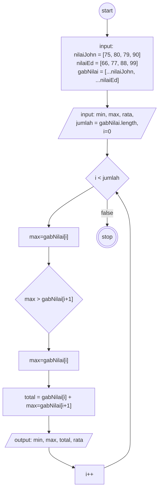

```mermaid
flowchart TD
start@{shape: circ}
array@{label: "input: 
nilaiJohn = [75, 80, 79, 90]
nilaiEd = [66, 77, 88, 99]
gabNilai = [...nilaiJohn, ...nilaiEd]"}
init@{shape: lean-r, label: "input: min, max, rata,
jumlah = gabNilai.length,
i=0"}

fori@{shape: diamond, label: "i < jumlah"}
i++
max@{label: "max=gabNilai[i]"}
ifmax@{shape: diamond, label: "max > gabNilai[i+1]"}
truemax@{label: "max=gabNilai[i]"}
total@{label: "total = gabNilai[i] + max=gabNilai[i+1]"}

output@{shape: lean-r, label: "output: min, max, total, rata"}
stop@{shape: dbl-circ}

start-->array-->init-->fori
fori-->max-->ifmax-->truemax-->total-->output-->i++-->fori
fori-->|false| stop

```